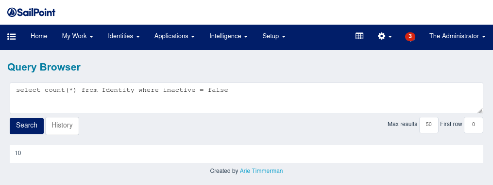

# IIQuery

Run [HQL](https://docs.jboss.org/hibernate/orm/3.3/reference/en/html/queryhql.html) queries directly from the SailPoint IdentityIQ web interface.

You can already do this via the `iiq console`. This plugin brings the same functionality to the web interface.

## Usage

Install the plugin and visit the following URL or press the table icon in the navigation bar.

~~~
http://YOUR-IDENTITYIQ-HOST/identityiq/plugins/pluginPage.jsf?pn=IIQuery
~~~

Make sure you have been assigned the new `IIQueryRunner` capability (or `SystemAdministrator`).

Now type in a HQL query and press _Search_.

## Features

* Run HQL queries
* Set first row and max results
* Remembers the last 50 queries (in your web browser)

## Screenshot

## Support

This plugin is developed by [Arie Timmerman](https://www.linkedin.com/in/arie/) from [a11n](https://www.a11n.nl).